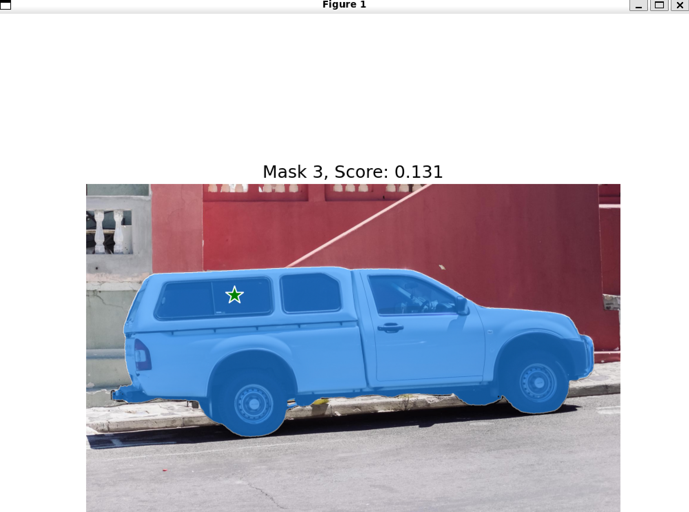

# 👀 Segment Anything 2 + Docker  🐳


Segment Anything in Docker. A simple, easy to use Docker image for Meta's SAM2 with GUI support for displaying figures. Built on top the SAM2 repo: https://github.com/facebookresearch/segment-anything-2


## Quickstart

This quickstart assumes you have access to an NVIDIA GPU.

First, let's install the NVIDIA Container Toolkit:

```bash
distribution=$(. /etc/os-release;echo $ID$VERSION_ID) \
   && curl -s -L https://nvidia.github.io/nvidia-docker/gpgkey | sudo apt-key add - \
   && curl -s -L https://nvidia.github.io/nvidia-docker/$distribution/nvidia-docker.list | sudo tee /etc/apt/sources.list.d/nvidia-docker.list
sudo apt-get update
sudo apt-get install -y nvidia-docker2
sudo systemctl restart docker
```

To get the SAM2 Docker image up and running, you can run:

```bash
docker run -it -v /tmp/.X11-unix:/tmp/.X11-unix  -e DISPLAY=$DISPLAY --gpus all peasant98/sam2:latest bash
```

From this shell, you can run SAM2, as well as display plots and images.

## Building and Running Locally

To build and run the Dockerfile:

```bash
docker build -t sam2:latest . 
```

And you can run as:

```bash
docker run -it -v /tmp/.X11-unix:/tmp/.X11-unix  -e DISPLAY=$DISPLAY --gpus all sam2:latest bash
```


Example of running Python code to display masks:



